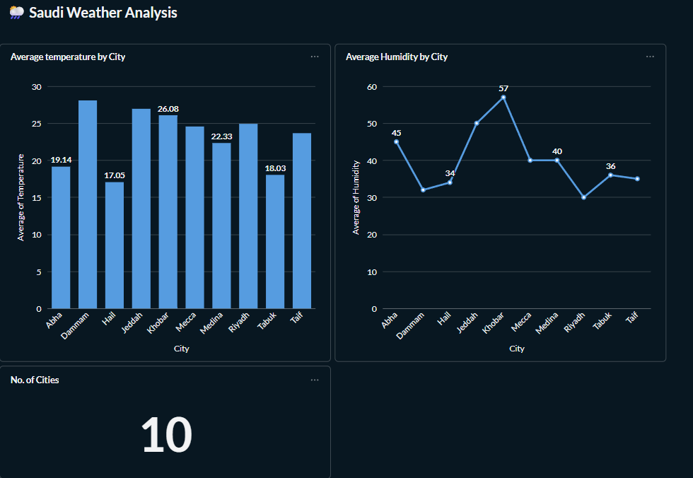

# 🌦️ Saudi Weather Data Pipeline — Airflow, Docker, PostgreSQL & Metabase

This project is a fully containerized ETL data pipeline that collects daily weather data for major Saudi Arabian cities using the OpenWeatherMap API.
The data is processed and stored automatically through Apache Airflow, saved into PostgreSQL, and visualized using Metabase.


---

## 🛠️ Tech Stack

**Airflow** — Workflow orchestration

**PostgreSQL** — Weather data storage

**Docker** — Infrastructure & service management

**Metabase** — Dashboards & data exploration

**pgAdmin** — Database GUI for development

---

## 🔎 Project Overview

This pipeline automatically:
- Fetches up-to-date weather information (temperature, humidity, description, etc.)
- Covers 10 major cities in Saudi Arabia
- Inserts the data into a PostgreSQL table
- Runs daily through an Airflow DAG
- Enables dashboard creation using Metabase

---

## ✨ Project Visualization (Metabase Dashboard)

The final output is visualized in a Metabase dashboard, showing key weather metrics collected by the pipeline.
<p align="center">
  
</p>

---

## 🚀 Getting Started

Follow the steps below to run the project locally.

1. **Clone the repository**
   ```bash
   git clone https://github.com/MohammedAlhojaily/Saudi-weather-pipeline.git
   cd weather-data-pipeline

2. **Create an environment file**
   ```bash
   cp .env.example .env

Then edit .env and add:
Your OpenWeatherMap API key Database usernames/passwords of your choice
You can generate your API key here: [here](https://openweathermap.org/current). 

3. **Start the services**
   ```bash
   docker compose up --build

4. **Access the tools**
- **Airflow:** http://localhost:8080
- **pgAdmin:** http://localhost:5050
- **Metabase:** http://localhost:3000

## 🎉 Completion
You now have a fully automated Saudi Weather ETL Pipeline.

## 👤 Author
This project was customized and built by Mohammed Alhojaily.
